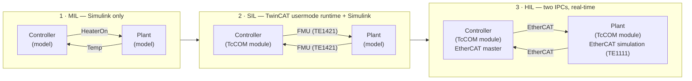

# MIL-SIL-HIL-Simulink-TwinCAT

One controller model, designed once in Simulink and taken **unchanged** through three test stages with
TwinCAT 3: model-in-the-loop, software-in-the-loop, and hardware-in-the-loop. Each stage swaps only what
surrounds the controller.

| Stage | Controller runs in | Plant runs in | Coupling |
| --- | --- | --- | --- |
| MIL | Simulink | Simulink | Signal lines |
| SIL | TwinCAT usermode runtime | Simulink | FMU |
| HIL | TwinCAT real-time, controller IPC | TwinCAT real-time, simulation IPC | EtherCAT |

The application is deliberately trivial: a PI temperature controller and a heater model. The point is the
workflow, and how little changes from one stage to the next.

## Getting started

Open `simulink/MIL_SIL_HIL_Guide.m` in MATLAB and run it section by section. It simulates the MIL stage,
installs the precompiled TwinCAT modules, and opens the TwinCAT projects for SIL and HIL. Nothing has to
be compiled.

| Stage | Needs |
| --- | --- |
| MIL | MATLAB R2026a, Simulink, Simulink Coder |
| SIL | MIL requirements, TwinCAT 3.1 Build 4026 with the usermode runtime |
| HIL | TwinCAT 3.1 Build 4026 on two IPCs, TE1111 EtherCAT Simulation on one of them |

Every TwinCAT product used here runs on a 7-day trial licence.

## Repository layout

| Path | Contents |
| --- | --- |
| `simulink/` | Models, parameters, runtime FMU, and the guide |
| `simulink/helpers/` | MATLAB functions that drive TwinCAT XAE through the Automation Interface and arrange the windows |
| `twincat/modules/` | Installers for the precompiled controller and plant modules |
| `twincat/sil/` | TwinCAT project behind the FMU |
| `twincat/hil-master/` | TwinCAT project for the controller IPC (EtherCAT master) |
| `twincat/hil-sim/` | TwinCAT project for the simulation IPC (EtherCAT simulation) |

## Credits and licence

The models are derived from the TE1400 sample *Basic Concepts: Generating TwinCAT Classes from Simulink
Models* by Beckhoff Automation GmbH & Co. KG.

Original content in this repository is released under the [BSD 2-Clause License](LICENSE). The TwinCAT
runtime inside `TcSimRuntimeTempCtrl.fmu` remains subject to Beckhoff's licence terms, which are
included in the FMU under `documentation/licenses`.

## Disclaimer

All sample code provided by Beckhoff Automation LLC are for illustrative purposes only and are provided
“as is” and without any warranties, express or implied. Actual implementations in applications will vary
significantly. Beckhoff Automation LLC shall have no liability for, and does not waive any rights in
relation to, any code samples that it provides or the use of such code samples for any purpose.
